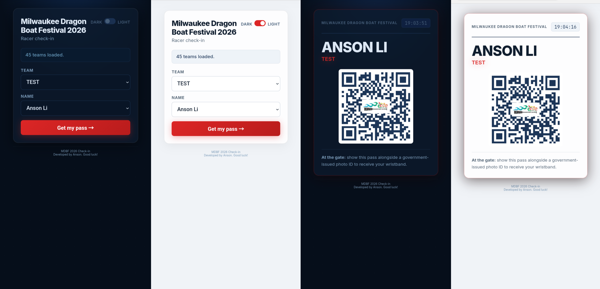
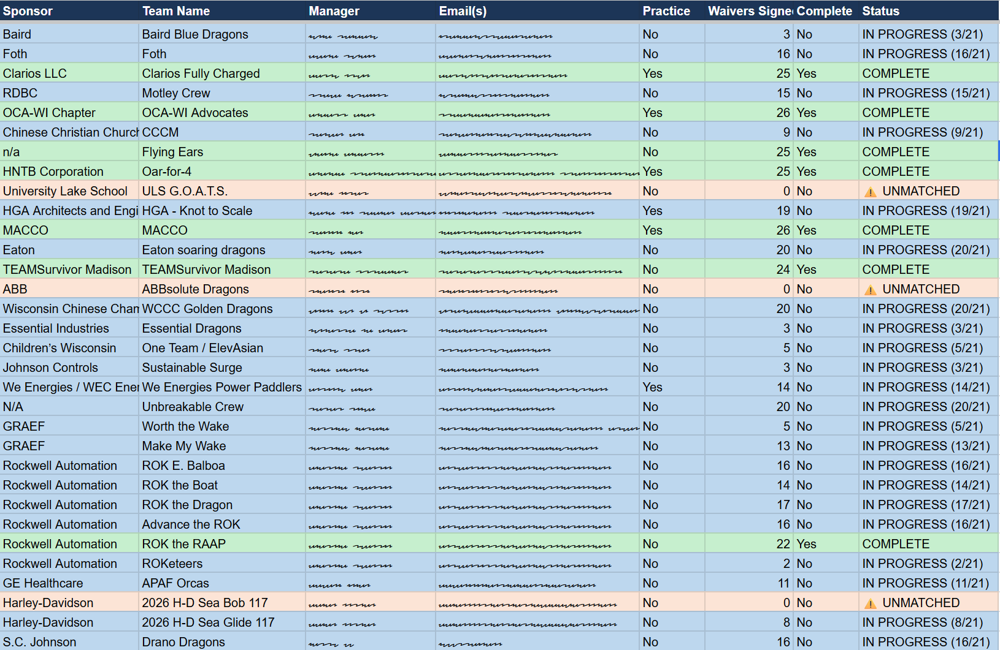
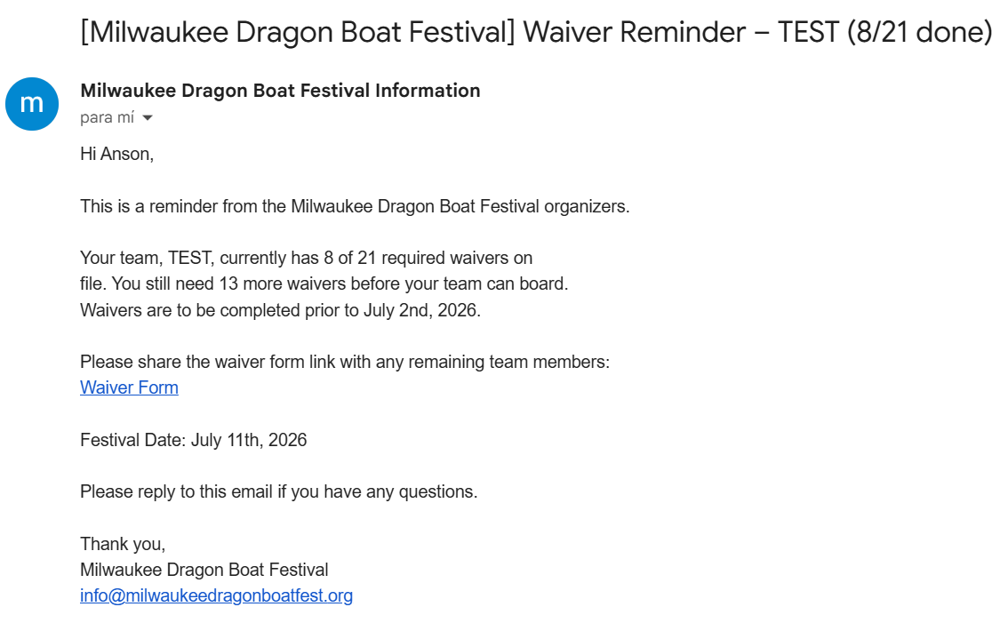

# Dragon Boat Festival Automation & Digital Check-In System

**Full-stack event management/ticketing solution for the Milwaukee Dragon Boat Festival (2026). Scaled to handle 50+ teams and 1,300+ racers.**

---

## Project Overview
This project modernizes management of the cultural festival through logistics (like liability tracking) and a speedy gate entry system. It is made up of two separate solutions:
1. **Custom Automated Backend:** Programmed with Google Apps Script to cross-reference the two live Google Sheets databases (one with the filled out waivers, the other with the registered teams and captain emails) and automate email reminder communications.
2. **Mobile Web Portal:** A responsive frontend UI that processes the live database and generates secure, un-fakeable digital QR passes for streamlined event entry.

---

## Solutions

**1. Logistics / Communication Slowdowns**
* **Problem:** Before, event admins and organizers had to spend lots of valuable time manually counting between spreadsheets to track waiver completion across such a high volume of teams. This led to severe slowdowns and delayed communication.
* **Solution:** Google Apps Script backend that auto-links signed waivers to registered teams using fuzzy-matching logic. It then uses that realtime data to send targeted reminder emails to team captains on a set schedule.

**2. Gate Security / Liability Risks**
* **Problem:** For liability and safety reasons, the festival required a true 100% strict waiver enforcement policy at the gate. Previous paper-list methods were too slow and led to human error and unauthorized entries.
* **Solution:** Custom mobile web portal where racers select their team and name (dynamically populated *only* if their waiver is signed). Instantly creates a secure, un-fakeable digital pass with a QR code and a bolded name which can easily and efficiently checked against a government ID at the gate. 

---

## Architecture/Tech Stack

* **Frontend:** HTML, CSS, JavaScript (designed to have high performance and mobile responsiveness)
* **Backend:** Google Apps Script (REST API that handles GET/POST requests)
* **Database:** Google Sheets (Live data sync and team roster management)
* **Accessibility:** Built-in Light/Dark mode toggles for outdoor visibility and vision accessibility.

---

## Demos

### 1. Digital Check-In Web Portal
*(The mobile-first UI used by 1,300+ racers at the gate)*

### 2. Live Admin Dashboard
*(The backend database tracking real-time waiver completion. NOTE: Names and emails redacted, not all rows are shown.)*

### 3. Automated Email Communication System
*(Automated notifications sent to team captains)*

---

## Deployment/Usage Note

This repo contains the source code for a specialized production. Since the system is built for a permission-restricted Google Workspace context (Sheets and Apps Script), it is not designed to be cloned and/or run OOTB by 3rd parties. 

This code is presented to demonstrate full-stack problem solving, UI/UX design, and process automation. 

***
**Developed by Anson Li**